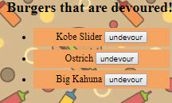
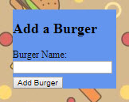
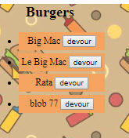

MVC Demo Web App - "Burgers".

The app demonstrates a deployed web app with back end/DB/Front end and MVC architecture.

The app is build with and implments following techonologies:

- JS/HTML/CSS
- JQuery
- Node JS
- Express JS
- mySql
- Handle Bars JS Templating Engine

The App allows a user to
 
- add an item to a db
- change the item and save the changes in the db
- there's also a disabled feature allowing the user to remove the item from a db

below are screenshots of main UI features (requirements)

